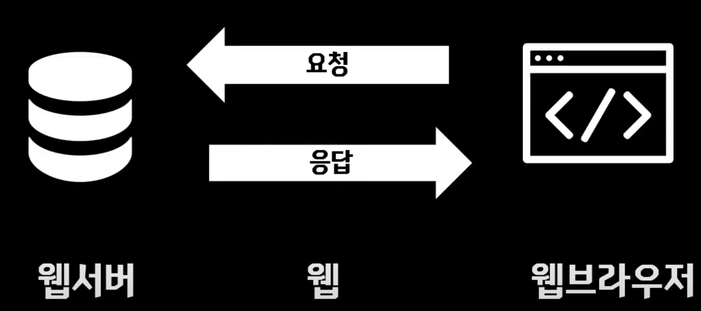
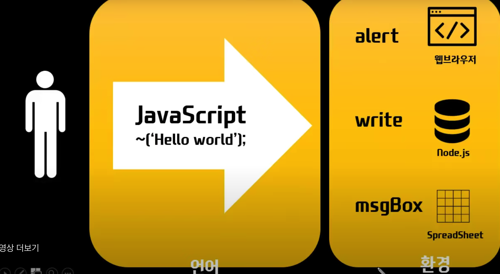

# TIL✏️ 2023.11.21 Mon

## OT

### 웹브라우저

- 자바스크립트 = 웹브라우저라는 소프트웨어들을 프로그래밍적으로 제어하기 위한 언어
    - 프로그래밍적 제어 : 프로그래밍 코드를 작성하여 브라우저를 프로그래밍적으로 제어할 수 있게 되는 것 → 프로그램을 통해 제어 하는 것

### 탈웹브라우저

- 자바스크립트가 웹브라우저 제어를 위한 용도로만 사용되고 있지 않음
- 자바스크립트라는 언어와 자바스크립트가 동작하는 환경(웹브라우저)을 분리해서 생각해야할 필요성이 O

### 웹서버

- 자바스크립트는 웹서버를 동작하기 위한 도구로서 사용이 됨 (= 서버사이드 스크립트라고도 함)
- 브라우저에서 동작하는 자바스크립트 = 클라이언트 사이드 스크립트

### node.js

- 자바스크립트를 웹서버에서도 사ㅇ용할 수 있도록 하는 기술 등장 ⇒ PHP, JAVA, Python …
    - 역할 :  사용자와 웹브라우저에게 응답하기 위한 정보를 프로그래밍적으로 생성해주는 기술
- 해당 기술들 중 가장 대표적 기술
- 웹 사이트 제작 시 웹브라우저,웹서버 모두를 자바스크립트로 통일 시킬 수 있다는 장점이 생김

### 탈웹

- 웹 바깥쪽 기술에서도 사용되기 시작
    - 대표적 사례 : google apps script (엑셀)

### 언어란?

- 의사소통을 위한 약속
- 문법에 따라 하고자하는 일을 작성해야 함 ⇒ 프로그래밍 언어

### 환경이란?

- 다양한 분야에서 사용되고 있기 때문에 언어라는 것과 언어가 동작하는 환경을 조금 분리해서 생각하면 됨
- 언어 사용 대상
    

    
    - 자바스크립트 문법 언어(’’,;)로 각 사용 대상에 맞게 부탁함 (부탁 환경 = 웹브라우저(=alert), node.js(=write), spreadsheet(=msgBox))
    - 명령어가 다르기 때문에 맞게 사용해야함
    

*사용자에게 제공되는 ui를 통해서 그 시스템들을 제어하는 것 ⇒ 코드를 통해 제품을 제어 → 우리의 소프트웨어가 만들어짐 → 해당 소프트웨어는 일반 사용자가 버튼을 누르는 것
