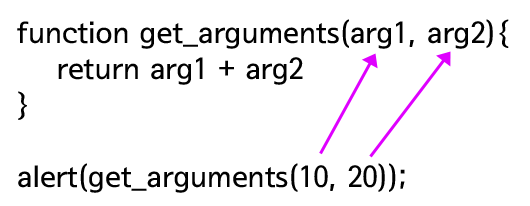

# TIL✏️ 2023.12.04 Mon

## 함수(function)

### 함수란?

- 하나의 로직을 재실행 할 수 있도록 하는 것 → 코드의 재사용성 높여줌
    - 코드 작성 시간 줄여줌
    - 하나를 수정하면 모든 곳이 한번에 수정 가능

> ### ***함수의 형식***

- function으로 시작
- 형식 : `function ****함수명( [인자...[,인자]] ){코드 return 반환값}`
    - 함수 이름을 활용하여 중괄호 안에 있는 코드 재사용 가능

> ### ***함수의 정의와 호출***

- 함수 호출 방법 : 함수명();
    
    *변수의 호출 방법 : 변수명;
    

### 함수의 효용

> ### ***함수가 없을 경우***

- 0-9까지의 숫자를 5번 출력하는 애플리케이션을 만든다면 로직이 길어짐
    
    → 이때 함수를 사용한다면 해당 문제를 줄일 수 있음
    
    - 예시
        
        ```jsx
        var i = 0;
        while(i < 10){
            document.write(i"<br />");
            i += 1;
        }
        // 이걸 5번씩 써야 함
        ===================================
        // 함수로 설정해주면 한번만 쓰고 함수명을 5번만 적으면 됨
        function numbering(){
            var i = 0;
            while(i < 10){
                document.write(i"<br />");
                i += 1;
            }   
        }
         
        numbering();
        numbering();
        numbering();
        numbering();
        numbering();
        ```
        
- 근데 이보다 훨씬 많은 호출을 해야 한다면 함수로 호출하는 것도 어려움
    
    → for문 사용
    
    - 예시
        
        ```jsx
        function numbering(){
            var i = 0;
            while(i < 10){
                document.write(i"<br />");
                i += 1;
            }   
        }
        for(var i =0; i < 1000; i++){
        		numbering();
        }
        // 이와 같은 논리지만 아래처럼 쓰는게 더 합리적이다
        
        for(var i =0; i < 1000; i++){
        	    var i = 0;
        	    while(i < 10){
                document.write(i"<br />");
                i += 1;
            }
        }
        ```
        

** 함수가 갖고 있는 효용 : 반복적으로 실행되는 로직이 여러 맥락에서 반복되어 사용하는 경우에 의미가 있음

⇒ 즉, 여기저기에서 반복되어서 사용되어야 하는 경우

반복문이 갖고 있는 효용 : 기계적으로 일정한 반복을 그 자리에서 실행할 때 의미가 있음

⇒ 해당 구간에서만 반복적으로 사용되어야 하는 경우

🎱 함수를 통해서 얻을 수 있는 효과 : 재사용성

재사용성의 핵심 : 동일한 코드를 여러군데에서 사용할 수 있는 형태로 만드는 것

재사용성의 장점 : 해당 함수를 사용하고 있는 여러군데에서 해당 함수의 내용을 수정할 시 하나의 코드만 수정하면 됨 → 유지보수 측면에서 good, 코드의 가독성 good, 다른 사람과 함께 사용하기에도 좋음(코드공유)

### 함수의 출력

> ### ***return***

- return 뒤에 따라오는 값을 함수의 결과로 반환 + 함수 종료(동시에 진행됨)
    
    `function get_member1(){return ****'egoing';}` → 함수 get_member1의 값으로 egoing을 반환
    
- 함수를 중지 시키는 역할도 함
    
    ```jsx
    function get_member(){
        return 'egoing';
    // return은 해당 값을 배출해주고 중지시킴
        return 'k8805';
        return 'sorialgi';
    }
    alert(get_member());
    
    // 결과는 egoing 출력
    ```
    

### 함수의 입력

> ### ***인자***

```jsx
function get_argument(arg){
				// grg = 매개변수(parameter)
    return arg;
		// arg를 반환
}
/* 만약 return arg*1000이 작성되어 있으면 아래의 alert(get_argument(1)); 값은 1000이, 
alert(get_argument(2)); 값은 2000이 출력됨 */
 
alert(get_argument(1)); 
/* get_argument의 () 안에 들은 값(인자(argument))을 위에 같은 이름으로 써진 get_argument에 넣어줌
	 즉, arg = 1 */
// 그럼 arg = 1 이기 때문에 해당 값은 1이 출력됨
alert(get_argument(2));
// arg =2 해당 값 2 출력
    // *예시일뿐 좋은 코드는 아님
```


- arg = 매개변수(parameter) ⇒ 값을 받는 변수
- get_argument의 () 안에 들은 값 = 인자(argument) ⇒ 값자체

### ***복수의 인자***

- 인자 = 여러개의 입력값을 가질 수 있음
- return = 하나만 가질 수 있음

```jsx
function get_arguments(arg1, arg2){
// arg1 = 매개변수1, arg2 = 매개변수2
    return arg1 + arg2
}
 
alert(get_arguments(10, 20));
// 10 = 매개변수1, 20 = 매개변수2
alert(get_arguments(20, 30));
```




### 함수의 다양한 정의 방법

```jsx
var numbering = function (){
// 함수 앞에 numbering 이라는 변수가 들어있음
    i = 0;
    while(i < 10){
        document.write(i);
        i += 1;
    }   
}
/* 함수에 대한 정의 부분이 좌항에 있는 numbering이라는 변수에 대입
	 => numbering이라는 변수가 함수를 갖게 됨 */
numbering();
// 변수에 함수 기호인 ()를 붙여주면 아래와 같이 정의한 것과 똑같은 결과를 갖게 됨

function numbering(){
	i = 0;
	while(i < 10){
				document.write(i);
				i += 1;
}
```

- 익명함수 : 함수를 정의 하는 것과 함수를 바로 호출하는 것을 하나의 문장으로 작성 하는 방법 ⇒ 1회성
```
(function (){
	i = 0;
	while(i < 10){
				document.write(i);
				i += 1;
})();
// 함수명이 정의되지 않은 함수를 ()로 묶어주고 ()로 바로 호출
```
