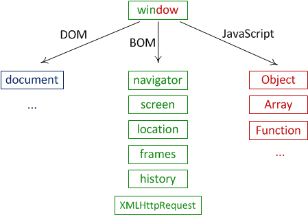

# TIL✏️ 2023.12.08 Fri

## HTML에서 Javascript 로드 - 사용자와 커뮤니케이션

## HTML에서 Javascript 로드

*해당 내용은 이미 숙지가 되어있는 상태로 다소 설명이 부족할 수 있음

### ***inline (3순위)***

- 태그에 직접 자바스크립트를 기술하는 방식
- 장점 : 태그 연관 스크립트가 분명하게 드러남
- 단점 : 정보와 제어가 섞여 있기 때문에 정보로서의 가치가 떨어짐

### ***script (2순위)***

-  태그를 만들어 자바스크립트 코드 삽입하는 방식
- inline 방식의 단점을 해결할 수 있는 방식
- 장점 : html 태그와 javascript코드 분리 가능

### ***외부파일로 분리 (1순위)***

- 별도의 파일로 분리
- 장점
    - 보다 엄격하게 정보와 제어를 분리할 수 있음
    - 재활용성 높음
    - 캐쉬 이용하여 속도 향상, 전송량 경량화 도모 가능
        - 캐쉬 : 이미 다운로드 받은 파일을 저장해줌 → 계속 다운 받지 않도록 해줄 수 o

### ***script 파일의 위치***

- body 태그의 하단에 위치시키는 것이 더 좋음
- head 태그보다 페이지의 하단에 위치시키는 것이 더 좋음

## Object Model

- **J**ava**S**cript **C**ore, **B**rowser **O**bject **M**odel, **D**ocument **O**bject **M**odel
    - 위 3가지는 자바스크립트를 제어하는데 있어서 큰 틀의 역할

<aside>
💡 ex) 자바스크립트를 통해서 <이미지>를 제어하려면  태그가 자바스크립트로 제어 가능한 상태(object)여야 함 (브라우저에서 이미 각각의 태그마다 객체를 만들어 두고 준비 해둠 ⇒ 우리가 준비해야 하는 건 아님)

</aside>

<aside>
💡 → 이미 만들어진 객체를 찾아 그 객체를 대상으로 메소드를 호출/프로퍼티 값을 가져오면서 객체 제어 o

객체 제어 : 그 객체가 가르키고 있는 태그를 제어한다는 의미

객체를 찾는 방법 : getElementsBy________을 사용 → 복수의 태그(or element)들의 목록을 가졌다는 의미 → 배열을 return 값으로 나타냄

🎱, 태그 하나하나가 객체로 이루어져 있는 것 객체화 시킨 것이록 이해하면 쉬움

</aside>

- 웹 브라우저의 구성요소들은 하나하나 객체화 되어 있음 → 객체를 자바스크립트를 통해서 제어하여 웹브라우저를 제어할 수 있음
- 서로 계층적인 관계로 구조화 되어 있음
- BOM과 DOM은 구조를 구성하고 있는 가장 큰 틀의 분류임

브라우저 객체들의 관계

**window 객체** : 전역 객체, window(or frame)을 제어하기 위한 객체

- Document Object Model (window 객체가 가진 프로퍼티 중 가장 중요함)
    - document : 가장 중요한 프로퍼티, html의 문서 <body>, …을 제어하는 역할
    - document = window.document ⇒ window.을 붙이지 않아도 같은 의미 ⇒ (window.)document
- Browser Object Model
    - 웹 브라우저를 제어하기 위해서 브라우저가 제공해주는 객체들
        - 현재 웹 브라우저가 가르키고 있는 url을 알아냄, 현재 웹 브라우저가 표시하고 있는 페이지 리로더, 경고창을 띄우는 것을 담당하는 객체
    - 해당 객체는 window객체의 프로퍼티들에 저장되어 있음
- JavaScript Core
    - 자바스크립트가 자체적으로 가지고 있는 객체들
    - browser(BW), goole apps script(GAS), node.js를 제어할 수 있음

**DOM = 문서를 제어함, BOM = 브라우저 자체를 제어 ⇒ 브라우저라는 호스트 환경에서만 존재하는 객체

→ GAS, node.js에서는 존재하지 X

⇒ DOM, BOM, JavaScript Core를 제어하는 언어 = javascript
