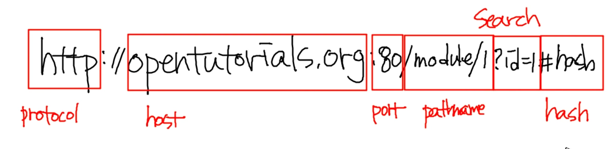
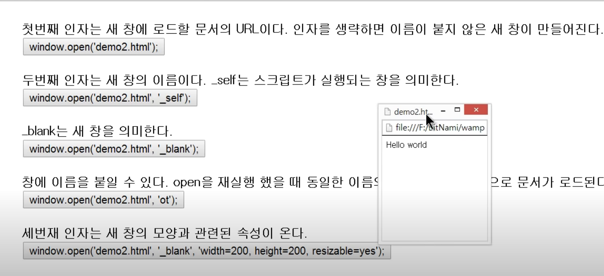

# TIL✏️ 2023.12.11 Mon

## Location객체 - 창제어

## Location 객체

- 문서의 주소와 관련된 객체로 window 객체의 프로퍼티
    - 현재 브라우저의 창에 열려있는 문서의 url을 알려주는 객체
- window의 문사 url 변경 O, 문서의 위치관련 다양한 정보 획득 O

> ### ***현재 윈도우의 URL 알아내는 방법***

- `console.log(~~location.toString()~~, location.href);`
    - location.tostring()은 선호하지 않음
    - location.href라는 프로퍼티에 접근했을 때 출력되는 결과를 출력

> ### ***URL parsing***

- URL을 의미에 따라서 별도의 프로퍼티로 제공
- `console.log(location.protocol, location.host, location.port, location.pathname, location.search, location.hash)`
    - EX) https://opentitorials.org:8800/moudule/904/6634/?id=10#bookmark
    - protocol = 현재 문서의 프로토콜 ex) https:
    - host = 컴퓨터 서비스를 식별하는 주소 ex) opentitorials.org
    - port = 컴퓨터에서 돌아가는 여러가지 sw를 식별하는 것 ex) :8800
    - pathname = 웹서버에 접속했을 시 웹서버가 가진 정보 중에 구체적인 정보를 요청하는 정보 ex) module/904/6634
    - search = 이 서비스에 전달된 id값이 10이라는 의미 ex) ?id=10
    - hash = 문서 안에 특정한 위치를 지정하면 해당 위치에 북마크를 할 수 O ex) #bookmark
        
    
        

> ### ***URL 변경***

- 현재 문서를 다음으로 이동
    - `location.href = '[http://egoing.net](http://egoing.net/)';`
    - `location = '[http://egoing.net](http://egoing.net/)';`
- 현재 문서 리로드 하는 방법
    - `location.reload();`
    

## Navigator 객체

- 자바스크립트를 이용해서 현재 해당 자바스크립트가 실행되고 있는 browser의 버전을 할 수 있음
- 어떤 브라우저냐에 따라 브라우저의 특성에 맞는 코딩을 할 수 있는 기능을 제공
- 해당 객체의 모든 프로퍼티 열람 방법
    - `Navigator`
    - `console.dir(navigator);`

> ### ***cross browsing***

- 브라우저마다 다른 결과물을 나타낼 수 있기 때문에 브라우저가 무엇인지를 알고 해당 특성에 맞는 코딩을 해야하는 경우가 O → 이를 가능하게 하는 것이 navigator ⇒ 해당 이슈를 cross browsing

> ### ***appName***

- 웹 브라우저의 이름
- 파이어폭스, 크롬  = Nescape로 표시

> ### ***appVersion***

- 브라우저 버전
- 브라우저 정보
    - ex) "5.0 (Windows NT 6.3; WOW64) AppleWebKit/537.36 (KHTML, like Gecko) Chrome/34.0.1847.116 Safari/537.36”

> ### ***userAgent***

- 웹 브라우저를 다르게 얘기 할 때 사용
- 브라우저가 서버에 요청할 때 전송하는 USER-AGENT-HTTP 헤더의 내용
- appVesrion과 비슷 BUT, 브라우저마다 다르게 나올 수 O

> ### ***platform***

- 브라우저가 동작하고 있는 운영체제에 대한 정보

### 기능테스트

- 작성한 코드가 해당 브라우저에 사용하고자 하는 API의 존재를 파악하는 기능
- 예제
    
    Object.keys라는 메소드는 객체의 key 값을 배열로 리턴하는 Object의 메소드
    
    해당 메소드는 ECMAScript5에 추가 되었기 때문에 오래된 자바스크립트와는 호환되지 x
    
    따라서, 아래는 호환성 맞추는 방법
    
    ```jsx
    if(!Object.keys) {
        // Object.keys가 false일 때 !가 붙으면 true로 바뀌고 if안의 조건문 실행 됨
          Object.keys = (function () {
          // 만약, object라는 객체가 keys를 가지고 있다면 해당 문장을 실행 안하고 그냥 key를 사용
          //  가지고 있지 않다면 key라는 메소드를 해당 문장으로 정의하면 됨
          'use strict';
          var hasOwnProperty = Object.prototype.hasOwnProperty,
              hasDontEnumBug = !({toString: null}).propertyIsEnumerable('toString'),
              dontEnums = [
                'toString',
                'toLocaleString',
                'valueOf',
                'hasOwnProperty',
                'isPrototypeOf',
                'propertyIsEnumerable',
                'constructor'
              ],
              dontEnumsLength = dontEnums.length;
          
          return function (obj) {
            if (typeof obj !== 'object' && (typeof obj !== 'function' || obj === null)) {
              throw new TypeError('Object.keys called on non-object');
            }
          
            var result = [], prop, i;
          
            for (prop in obj) {
              if (hasOwnProperty.call(obj, prop)) {
                result.push(prop);
              }
            }
          }
          if (hasDontEnumBug) {
              for (i = 0; i < dontEnumsLength; i++) {
                if (hasOwnProperty.call(obj, dontEnums[i])) {
                  result.push(dontEnums[i]);
                }
              }
            }
            return result;
          }());
    ```
    

## 창제어

> ### ***window.open()***

- [window.open/window.close](http://window.open/window.close) = 새창을 열거나 닫음
    - `window.open(’demo2.html’);`
        - demo2.html이라는 인자를 붙여주지 않으면 이름이 붙지 않은 새 창이 만들어짐 ⇒ 새창에서 열기
    - 첫번째 인자
- _self
    - `window.open(’demo2.html’, ’_self’);`
    - 현재 열려 있는 창에서 새페이지 실행 (새 창에서 열기 X)
    - a태그의 target이라는 값에 넣어줌
    - 두번째 인자로 사용
- _blank
    - `window.open(’demo2.html’, ’_blank’);`
    - 새 창에서 열기
    - a태그의 target이라는 값에 넣어줌
    - 두번째 인자로 사용
- ot
    - `window.open(’demo2.html’, ’ot’);`
    - open을 재실행 했을 때 동일한 이름의 창이 있다면 그곳으로 문서가 로드 됨
    - 창에 이름 지정 O
- 세번째 인자 사용
    - 아예 새로운 창이 생성되면서 거기서 열림
        
    
        
    - `window.open('demo2.html', '_blank', 'width=200, height=200, resizable=no');`
        - 스타일 지정 →  지정한 값대로 로드
        - resizable을 no로 지정하면 사용지가 창의 사이즈 변경 불가, yes로 하면 변경 가능

> ### ***상호작용***

- 새로운 창에 접근
- 예시
    
    ```html
    <!DOCTYPE html>
    <html>
    <body>
        <input type="button" value="open" onclick="winopen();" />
    		<!-- open이라는 버튼을 클릭하면 onclick="winopen(); 실행되면서 아래의 첫번째 함수가 실행 됨 -->
        <input type="text" onkeypress="winmessage(this.value)" />
    		<!-- onkeypress라는 이벤트를 이용하면 사용자가 타이핑을 하여 글자를 완성할 때마다 winmessage(this.value) 자바스크립트를 호출-->
    		<!-- 텍스트 안에 입력된 값이 this.value임 -->
        <input type="button" value="close" onclick="winclose()" />
    		<!--  -->
        <script>
        function winopen(){
            win = window.open('demo2.html', 'ot', 'width=300px, height=500px');
    				// window.open을 통해서 새창을 열게 되면 window.open라는 메소드는 새로운 demo2.html이라는 파일을 담고 있는 새로운 창의 윈도우 객체가 window.open의 리턴 값으로 리턴해줌
        }
        function winmessage(msg){
            win.document.getElementById('message').innerText=msg;
    				// 
        }
        function winclose(){
            win.close();
        }
        </script>
    </body>
    </html>
    ```
    
    이거 잘 활용해서 모달창 만들때 쓸 수 있을 듯!!
    

### 보안

- 브라우저의 스크립트가 사용자의 브라우저에 특정 파일을 읽어 자신의 사이트로 전송하는 등의 일이 생기는 것 → 보안취약점
- 해당 문제가 안일어나도록 차단

> ### ***팝업차단***

- 사용자의 인터렉션 없이 탕을 열려고 하면 팝업 차단됨

🔚 BOM 끝
