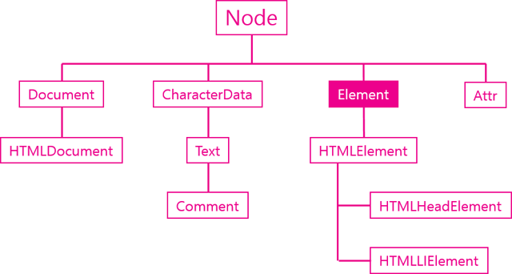
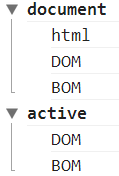

# TIL✏️ 2023.12.18 Mon

## Element 객체

- 엘리먼트를 추상화한 객체
- Element와 HTMLElement를 구분하는 이유 : DOM이 HTML만을 위한 규격은 아니기 때문
    
    즉, 마크업 언어를 제어하기 위한 규격이기 때문에 HTML, XML, SVG, XUL과 같은 마크업 언어들은 Element를 가지고 있음
    
    🎱, HTML이라고 하는 특정한 언어의 element들이 부가적으로 가지고 있어야할 기능들을 추가하기 위해서 2개의 기능들을 분리시킨 것임
    

    

> ### ***element가 가지고 있는 주요기능***

**식별자**

문서 내 특정 엘리먼트를 식별하기 위한 용도로 사용되는 API

- Element.classList
- Element.className
- Element.id
- Element.tagName

**조회**

엘리먼트의 하위 엘리먼트를 조회하는 API

- Element.getElementsByClassName
- Element.getElementsByTagName
- Element.querySelector
- Element.querySelectorAll

**속성**

엘리먼트의 속성을 알아내고 변경하는 API

- Element.getAttribute(name)
- Element.setAttribute(name, value)
- Element.hasAttribute(name);
- Element.removeAttribute(name);

### 식별자 API

- 각각의 엘리먼트들이 찾아낼 수 있도록 하는 식별자
- 엘리먼트를 제어하기 위해서 그 엘리먼트를 조회해야 함 조회하기 위한 식별자가 필요함

> ### ***Element.tagName***

- 엘리먼트의 태그 이름을 알아냄
- `.tagName`
- 태그 이름 변경 X (읽기 전용)
- 예제
    
    ```html
    <ul>
        <li>html</li>
        <li>css</li>
        <li id="active" class="important current">JavaScript</li>
    </ul>
    <script>
    console.log(document.getElementById('active').tagName)
    </script>
    ```
    

> ### ***Element.id***

- 문서에서 id는 단하나만 등장할 수 있는 식별자
- 변경 가능
- 읽는 방법
    
    `var active = document.getElementById('active');`
    
    `console.log(active.id);`
    
- id명 변경하는 방법
    
    `active.id = 'deactive';`
    
    `console.log(active.id);` → 결과가 deactive로 바뀌어 나타남
    
    *예를 들어 버튼 클릭이 인식되면 id값을 변경하고 그 id의 css를 적용하는 형식 구현가능
    

### ***Element.className***

- 여러개의 엘리먼트를 그룹핑할 때 사용
- 사용하기 까다로운편 → classList가 더 좋음
- class 변경하는 방법
    
    `var active = document.getElementsByclassName('active');`
    
    `active.className = "important current";`
    
- class 추가하는 방법
    
    `active.className += " readed”` → +=”추가할 className”
    

> ### ***Element.classList***

- clasName보다 편리한 사용성 제공
- class라는 프로퍼티에 저장되어 있는 객체가 뭔지 아는 방법
    
    `active.classList;`
    
    DOMTokenList : 엘리먼트의 여러개의 class를 모두 담아 두는 것, 유사배열임
    
- class 추가하는 방법
    
    `active.alssList.add(’important’);`
    
- class 제거하는 방법
    
    `active.alssList.remove(’important’);`
    
- class를 실행시에만 넣었다 빼는 방법
    
    `active.alssList.toggle(’important’);`
    

### 조회 API

- 엘리먼트를 조회하는 기능
- 하위 엘리먼트를 조회하려고 할 경우 Element객체가 갖고 있는 getElementsBy*를 이용
- 예시
    
    ```html
    <!DOCTYPE html>
    <html lang="en">
    <head>
      <meta charset="UTF-8">
      <meta name="viewport" content="width=device-width, initial-scale=1.0">
      <title>Document</title>
    </head>
    <body>
      <ul>
        <li class="marked">html</li>
        <li>css</li>
        <li id="active">JavaScript
            <ul>
                <li>JavaScript Core</li>
                <li class="marked">DOM</li>
                <li class="marked">BOM</li>
            </ul>
        </li>
      </ul>
      <script>
          // document.getElementsByClassName을 통해 조회하는 경우
          var list = document.getElementsByClassName('marked');
          console.group('document');
          for(var i=0; i<list.length; i++){
              console.log(list[i].textContent);
          }
          console.groupEnd();
          // id 엘리먼트를 먼저 가져오고 엘리먼트 객체에 대해서 document.getElementsByClassName을 통해 조회한 결과
          console.group('active');
          var active = document.getElementById('active');     
          var list = active.getElementsByClassName('marked');
          for(var i=0; i<list.length; i++){
              console.log(list[i].textContent);
          }
          console.groupEnd();
      </script>
    </body>
    </html>
    ```
    
    

    
    결과
    

### 속성(Attribute) API

- HTML에서 태그명만으로 부족한 부가적인 정보
    
    ex) target, href
    
- 속성값을 가져오는 방법
    
    `변수명.getAttribute(’속성’);`
    
- 속성 값 설정하는 방법
    
    `변수명.setAttribute(’바꾸려는 속성(기존속성)’, '변경할 속성(새로운 속성)');`
    
- 속성 값 추가하는 방법
    
    `변수명.setAttribute(’바꾸려는 속성(기존속성)’, '변경할 속성(새로운 속성)');`
    
    설정과 방법이 같음, 존재하지 않는 속성이라면 새로 추가가 됨
    
- 속성 값 제거하는 방법
    
    `변수명.removeAttribute(’삭제할 속성');`
    
- 속성이 있는지 체크하는 방법
    
    `변수명.hasAttribute(’속성');` → false = 없다 true = 있다
    

> ### ***속성과 프로퍼티***

- 모든 엘리먼트의 속성은  속성과 프로퍼티로 제어 가능

**속성과 프로퍼티의 차이점**

속성방식

- document.getElementById를 통해 변수 target에 담음
    
    → target엘리먼트에 setAttribute를 통해 class 값을 important로 지정
    
- `var target = document.getElementById('target');`
    
    `target.setAttribute('class', 'important');`
    

프로퍼티방식

- target에 프로퍼티 중에 classNamse을 직접 지정
    
    `target.className = 'important';`
    
- 간편하고 속도가 빠름
- 아래의 표처럼 실제 html 속성의 이름과 다른 이름을 갖는 경우가 있음
    
    
    | html명 | 프로퍼티명 |
    | --- | --- |
    | class | className |
    | readonly | readOnly |
    | rowspan | rowSpan |
    | colspan | colSpan |
    | usemap | userMap |
    | frameborder | frameBorder |
    | for | htmlFor |
    | maxlength | maxLength |
- 속성과 프로퍼티는 값이 다를 수도 O
    - 예제
        
        ```html
        <a id="target" href="./demo1.html">ot</a>
        <script>
        	//현재 웹페이지가 http://localhost/webjs/Element/attribute_api/demo3.html 일 때 
        	var target = document.getElementById('target');
        	// http://localhost/webjs/Element/attribute_api/demo1.html 
        	console.log('target.href', target.href);
        	// ./demo1.html 
        	console.log('target.getAttribute("href")', target.getAttribute("href"));
        </script>
        ```
        

### jQuery 속성제어 API

> ### ***속성제어***

- jQuery에서 속성은 setAttribute, getAttribute대신 attr이라고 사용
    
    removeAttribute 대신 removeAttr라고 사용
    
- setAttribute, getAttribute = attr
    
    removeAttribute = removeAttr
    

- 속성 가져오는 방법
    
    `변수명.attr('속성’);`
    
- 속성값 설정하는 방법
    
    `변수명.attr('속성', '설정할 속성값');`
    
- 속성 제거하는 방법
    
    `변수명.removeAttr('속성');`
    

> ### ***attribute와 property***

- 속성 = attr 메소드 사용, 프로퍼티 = prop 메소드 사용
- 속성을 가져올 때
    
    .attr = 적혀있는 그대로를 알려줌
    
    .prop = 전체 url을 알려줌
    
- 속성의 타입을 가져올 때
    
    .attr = checked가 있다면 checked라는 값 그대로 출력
    
    prop = checked가 있다면 true, 없다면 false
    

**장점**

- 기억하기 쉽다
- 이름이 다르다는 제약사항을 보정해줌

### jQuery 조회범위 제한

> ### ***selector context***

- 조회할 때 조회 범위를 제한하는 것을 말함
- 예제
    
    ```html
    <!DOCTYPE html>
    <html lang="en">
    <head>
      <meta charset="UTF-8">
      <meta name="viewport" content="width=device-width, initial-scale=1.0">
      <title>Document</title>
    </head>
    <body>
      <ul>
        <li class="marked">html</li>
        <li>css</li>
        <li id="active">JavaScript
            <ul>
                <li>JavaScript Core</li>
                <li class="marked">DOM</li>
                <li class="marked">BOM</li>
            </ul>
        </li>
      </ul>
      <script src="../lib/jquery-3.7.1.min.js"></script>
      <!-- id가 active인 것 안에 있는 class명이 marked인 것만 골라 배경을 빨간색으로 주고 싶은 경우 -->
      <script>
          $( ".marked", "#active").css( "background-color", "red" );
          // 1. 효과를 주고 싶은 엘리먼트를 지정 2. 인자1을 제어하고자 하는 엘리먼트가 오게 됨(selector context)
    			// $("#active, .marked").css("background-color", "red");라고 작성해도 됨
      </script>
    </body>
    </html>
    ```
    

> ### ***.find()***

- jQuery객체 내에서 엘리먼트를 조회하는 기능을 제공
- `$( "#active").find('.marked').css( "background-color", "red");`
    - selector context의 예제와 같은 결과
- 체인을 끊지 않고 작업의 대상을 변경하고 싶을 때 사용
    - ex) `$('#active').css('color','blue').find('.marked').css( "background-color", "red");` → id가 active인 엘리먼트에 글자색을 파란색으로 주고 하위에 class명이 marked인 엘리먼트에 배경색을 빨간색으로 줘라

*find를 너무 복잡하게 사용하면 코드 유지보수가 어렵다
