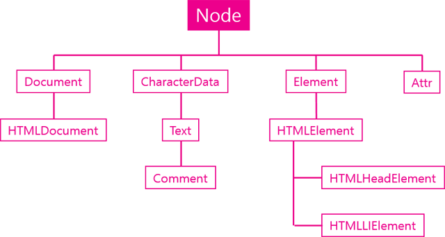

# TIL✏️ 2023.12.19 Tues

## Node 객체

- DOM에서 시조와 같은 역할
    - 모든 DOM객체는 Node 객체를 가짐
    
    

    

### Node객체가 가지고 있는 주요기능

### ***관계***

- 부모, 자식, 형제 관계로 연결된 관계성을 띄고 있음
- 각각의 node가 다른 node와 연결된 정보를 보여주는 API를 통해 문서 프로그래밍적으로 탐색 가능
- 서로의 관계를 알 수 O
    - Node.childNodes
        - 자식 엘리먼트의 목록 ex) ul
        - 자식 노드들을 유사배열에 담아서 리턴
    - Node.firstChild
        - 첫번째 자식노드
    - Node.lastChild
        - 마지막 자식노드
    - Node.nextSibling
        - 다음 형제노드 (ul의 다음 형제)
    - Node.previousSibling
        - 이전 형제노드
    - Node.contains()
        - 목록에 자식들 유무 확인
    - Node.hasChildNodes()
        - 목록에 자식들 유무 확인 (위와 비슷한 의미)
    - Node.parent
        - 부모노드 찾기
- 예제
    
    ```jsx
    var s = document.getElementById('start');
        console.log(1, s.firstChild); // #text -> 엘리먼트가 아니라 일반적인 텍스트모드 
        // 첫번째 자식노드가 나옴 
        var ul = s.firstChild.nextSibling
        console.log(2, ul); // ul
        console.log(3, ul.nextSibling); // #text
        console.log(4, ul.nextSibling.nextSibling); // script
        console.log(5, ul.childNodes); //text, li, text, li, text, li, text
        console.log(6, ul.childNodes[1]); // li(html)
        console.log(7, ul.parentNode); // body // 부모노드 찾기
    ```
    

### ***노드 종류***

- Node 객체가 어떤 구성요소가 어떤 카테고리에 속하는 것인지 알려주는 식별자
    - Node.nodeType
        - 노드의 타입
    - Node.nodeName
        - 노드의 이름(태그명)

**Node Type**

- 노드의 종류에 따라서 정해진 상수가 존재함
- 형식 : `for(var name in Node){console.log(name, Node[name]);}`
    - 결과
        
        ELEMENT_NODE 1
        ATTRIBUTE_NODE 2
        TEXT_NODE 3
        CDATA_SECTION_NODE 4
        ENTITY_REFERENCE_NODE 5
        ENTITY_NODE 6
        PROCESSING_INSTRUCTION_NODE 7
        COMMENT_NODE 8
        DOCUMENT_NODE 9
        DOCUMENT_TYPE_NODE 10
        DOCUMENT_FRAGMENT_NODE 11
        NOTATION_NODE 12
        DOCUMENT_POSITION_DISCONNECTED 1
        DOCUMENT_POSITION_PRECEDING 2
        DOCUMENT_POSITION_FOLLOWING 4
        DOCUMENT_POSITION_CONTAINS 8
        DOCUMENT_POSITION_CONTAINED_BY 16
        DOCUMENT_POSITION_IMPLEMENTATION_SPECIFIC 32
        
- 숫자를 외우기 어렵다면 `Node.TEXT_NODE`

**Node Name**

- 태그의 이름, 텍스트라는 정보를 제공함 (Node Type보다 좀 더 디테일하게 제공해줌)
- 형식 : `body.firstChild.nextSibling.nodeName`

### ***값***

- Node 객체의 값을 제공하는 API
    - Node.nodeValue
    - Node.textContent

### ***자식관리***

- Node 객체의 자식을 추가하는 방법에 대한 API
    - Node.appendChild()
    - Node.removeChild()

### 재귀함수

- 함수가 자기 자신을 호출하는 것
- 함수 `traverse` : 하나씩 조회한다
- traverse(매개변수1, 매개변수2){}
    - 매개변수1 : 조회하려고 하는 루트 엘리먼트 지정
    - 매개변수2 : 조회할 때마다 순번에 해당되는 엘리먼트들을 사용자 지정 함수의 인자로 전달해야 함
        - function이어야 함 = callback
- 예시
    
    ```html
    <!DOCTYPE html>
    <html>
    <body id="start">
      <!-- 1. 인자1 : 조회하고자 하는 엘리먼트를 지정
          2. 각각의 태그들을 조회할 때마다 인자2로 전달한 익명함수를 호출
          3. 익명함수의 인자1의 현재 조회하고 있는 순번에 해당되는 엘리먼트를 인자1로 vaule
          4. 콘솔창에 출력됨 -->
      <ul>
        <li><a href="./532">html</a></li> 
        <li><a href="./533">css</a></li>
        <li><a href="./534">JavaScript</a>
          <ul>
            <li><a href="./535">JavaScript Core</a></li>
            <li><a href="./536">DOM</a></li>
            <li><a href="./537">BOM</a></li>
          </ul>
        </li>
      </ul>
      <script>
      function traverse(target, callback){
        // callback(target);
        // 1. body태그 조회 2. body태그 자식 엘리먼트들을 하나씩 호출 3. 자식 엘리먼트들 하나하나 traverse라는 함수의 인자1로 전달 4. 마찮가지로 하나하나 자식 엘리먼트들을 인자1로 전달
        if(target.nodeType === Node.ELEMENT_NODE){
          callback(target);
          var c = target.childNodes;
          for(var i =0; i<c.length; i++){
            // for문이 동작하지 않을 때까지
            traverse(c[i], callback);
          }
        }
      }
      
      traverse(document.getElementById('start'), function(elem){
          console.log(elem);
      });
      </script>
    </body>
    </html>
    ```
    

### Node의 변경 API

### ***노드 추가***

- [appendChild(child)](https://developer.mozilla.org/en-US/docs/Web/API/Node.appendChild)
    - 노드의 마지막 자식에 엘리먼트 추가
    - 예제
        
        ```jsx
        function callAppendChild(){
                var target = document.getElementById('target');
                var li = document.createElement('li');
                var text = document.createTextNode('JavaScript');
                li.appendChild(text);
                target.appendChild(li);
            }
        ```
        
- [insertBefore(newElement, referenceElement)](https://developer.mozilla.org/ko/docs/Web/API/Node.insertBefore)
    - 인자2로 엘리먼트를 전달 했을 시 이것 **앞에** 엘리먼트 추가
    - 예제
        
        ```jsx
        function callInsertBefore(){
                var target = document.getElementById('target');
                var li = document.createElement('li');
                var text = document.createTextNode('jQuery');
                li.appendChild(text);
                target.insertBefore(li, target.firstChild);
            }
        ```
        

### ***노드 제거***

- [removeChild(child)](https://developer.mozilla.org/ko/docs/Web/API/Node.removeChild)
    - 메소드는 삭제 대상의 부모 노드 객체의 것을 실행해야 함
    - 예제
        
        ```jsx
        function callRemoveChild(){
                var target = document.getElementById('target');
                target.parentNode.removeChild(target);
            }
        ```
        

### ***노드 교체***

- [replaceChild(newChild, oldChild)](https://developer.mozilla.org/en-US/docs/Web/API/Node.replaceChild)
    - 예제
        
        ```jsx
        function callReplaceChild(){
                var a = document.createElement('a');
                a.setAttribute('href', 'http://opentutorials.org/module/904/6701');
                a.appendChild(document.createTextNode('Web browser JavaScript'));
         
                var target = document.getElementById('target');
                target.replaceChild(a,target.firstChild);
            }
        ```
        

### jQuery 노드 변경 API

- jQuery를 이용하여 노드 제어하는 방법
- jQuery사이트에서 노드 제어하는 기능 = Manipulation 카테고리에 있음
    
    참조 : http://api.jquery.com/category/manipulation/
    

### ***추가***

- 추가관련 주요 메소드
    - before
        - 태그 밖 앞쪽에 추가
    - prepend
        - 태그 안 content 이전에 추가
    - append
        - 태그 안 content 이후에 추가
    - after
        - 태그 밖 뒤쪽에 추가

    

content = 내용물

content를 감싸고 있는 바깥의 박스  = 태그

- 예제
    
    ```html
    <!-- <div>before</div> -->
    <div class="target">
    <!-- <div>prepend</div> -->
        content1
    <!-- <div>append</div> -->
    </div>
    <!-- <div>before</div> --> 
    <!-- <div>after</div> -->
    <div class="target">
    <!-- <div>prepend</div> -->
        content2
    <!-- <div>append</div> -->
    </div>
    <!-- <div>after</div> -->
     
    <script src="//code.jquery.com/jquery-1.11.0.min.js"></script>
    <script>
        $('.target').before('<div>before</div>');
        $('.target').after('<div>after</div>');
        $('.target').prepend('<div>prepend</div>');
        $('.target').append('<div>append</div>');
    </script>
    ```
    
    결과 : https://output.jsbin.com/gamezi/1/
    

### ***제거***

- remove
    - 선택된 엘리먼트 제거
- empty
    - 선택된 엘리먼트의 텍스트 노드 제거
- 예제
    
    ```html
    <!DOCTYPE html>
    <html lang="en">
    <head>
      <meta charset="UTF-8">
      <meta name="viewport" content="width=device-width, initial-scale=1.0">
      <title>Document</title>
    </head>
    <body>
      <!-- remove -->
      <div class="target" id="target1">
        target 1
      </div>
      <!-- empty -->
      <div class="target" id="target2">
          target 2
      </div>
      
      <input type="button" value="remove target 1" id="btn1" />
      <input type="button" value="empty target 2" id="btn2" />
      <script src="../lib/jquery-3.7.1.min.js"></script>
      <script>
          // 전체가 사라짐
          $('#btn1').click(function(){
              $('#target1').remove();
          })
          // 태그는 그대로 있고 텍스트만 사라짐
          $('#btn2').click(function(){
              $('#target2').empty();
          })
      </script>
    </body>
    </html>
    ```
    
    결과 : https://output.jsbin.com/bocay/1/
    

### ***교체***

- replaceAll
    - 노드의 내용을 교체
    - 제어 대상을 인자로 전달
- replaceWith
    - 노드의 내용을 교체
    - 제어 대상을 먼저 지정
- 예제
    
    ```html
    <div class="target" id="target1">
        target 1
    </div>
     
    <div class="target" id="target2">
        target 2
    </div>
     
    <input type="button" value="replaceAll target 1" id="btn1" />
    <input type="button" value="replaceWith target 2" id="btn2" />
    <script src="//code.jquery.com/jquery-1.11.0.min.js"></script>
    <script>
        $('#btn1').click(function(){
            $('<div>replaceAll</div>').replaceAll('#target1');
    					// <div>replaceAll</div>를 아이디 값이 target1인 엘리먼트에 교체
        })
        $('#btn2').click(function(){
            $('#target2').replaceWith('<div>replaceWith</div>');
    				// 아이디 값이 target2인 엘리먼트를 <div>replaceWith</div>로 교체
        })
    </script>
    ```
    
    결과 : https://output.jsbin.com/kotuv/1/
    

### ***복사***

- clone
    - 노드의 내용을 복사
- 예제
    
    엘리먼트1과 2를 3으로 교체하는 예제
    
    ```html
    <!--엘리먼트1-->
    <div class="target" id="target1">
        target 1
    </div>
    <!--엘리먼트2-->
    <div class="target" id="target2">
        target 2
    </div>
    <!--엘리먼트3-->
    <div id="source">source</div>
     
    <input type="button" value="clone replaceAll target 1" id="btn1" />
    <input type="button" value="clone replaceWith target 2" id="btn2" />
    <script src="//code.jquery.com/jquery-1.11.0.min.js"></script>
    <script>
    		// 순서 : 1. 엘리먼트3이 복사 2. 엘리먼트1/2에 교체
        $('#btn1').click(function(){
            $('#source').clone().replaceAll('#target1');
    				// btn1을 클릭했을 때 아이디 값이 source인 엘리먼트를 클론해서 아이디가 target1인 엘리먼트에 교체
        })
        $('#btn2').click(function(){
            $('#target2').replaceWith($('#source').clone());
    				// btn2을 클릭했을 때 아이디가 target1인 엘리먼트에 아이디 값이 source인 엘리먼트를 복사해서 교체
        })
    </script> 
    ```
    
    결과 : https://output.jsbin.com/bisuz/1/
    

### ***이동***

- 특정노드를 선택하면 이동의 효과가 남
- 예제
    
    ```jsx
    <div class="target" id="target1">
        target 1
    </div>
     
    <div id="source">source</div>
     
    <input type="button" value="append source to target 1" id="btn1" />
    <script src="//code.jquery.com/jquery-1.11.0.min.js"></script>
    <script>
        $('#btn1').click(function(){
            $('#target1').append($('#source'));
    				// append가 아닌 prepend, after, before 모두 사용 가능
        })
    ```
    
    결과 : https://output.jsbin.com/yujen/3/
    

### 문자열로 노드 제어 방법

노드 변경 API보다 편리하게 노드 조작 가능

### ***innerHTML***

- 문자열로 자식 노드 만들 수 O
    - 자식 노드의 값 읽어올 수 O

### ***outerHTML***

- 자기 자신을 포함하여 처리

**innerHTML과 outerHTML의 차이점**

innerHTML : 자식을 제어

outerHTML : 자신을 포함하여 제어

- 예제
    
    ```html
    <ul id="target">
        <li>HTML</li>
        <li>CSS</li>
      </ul>
      <input type="button" onclick="get();" value="get" />
      <input type="button" onclick="set();" value="set" />
      <script>
        // innerHTML
        function get(){
        var target = document.getElementById('target');
        alert(target.innerHTML);
        target이라는 엘리먼트 안쪽에 있는 코드가 그대로 출력
        }
        function set(){
        var target = document.getElementById('target');
        target.innerHTML = "<li>JavaScript Core</li><li>BOM</li><li>DOM</li>";
        // target의 엘리먼트의 기존있던 코드에 위에 작성한 내용으로 추가 변경 됨
        }
        
        // outerHTML
        function get(){
        var target = document.getElementById('target');
        alert(target.outerHTML);
        }
        function set(){
        var target = document.getElementById('target');
        target.outerHTML = "<ol><li>JavaScript Core</li><li>BOM</li><li>DOM</li></ol>";
        }
      </script>
    ```
    

### ***innerText, outerText***

- 값 읽을 시 : HTML 코드 제외한 문자열 리턴
- 값 변견 시 : HTML 코드를 그대로 추가
- 예제
    
    ```html
    <ul id="target">
        <li>HTML</li>
        <li>CSS</li>
    </ul>
    <input type="button" onclick="get();" value="get" />
    <input type="button" onclick="set();" value="set" />
    <script>
        function get(){
            var target = document.getElementById('target');
            alert(target.innerText);
        }
        function set(){
            var target = document.getElementById('target');
            target.innerText = "<li>JavaScript Core</li><li>BOM</li><li>DOM</li>";
        }
    </script>
    ```
    

### ***insertAdjacentHTML***

- 정교하게 문자열 이용하여 노드 변경하고 싶을 때 사용
- 예제
