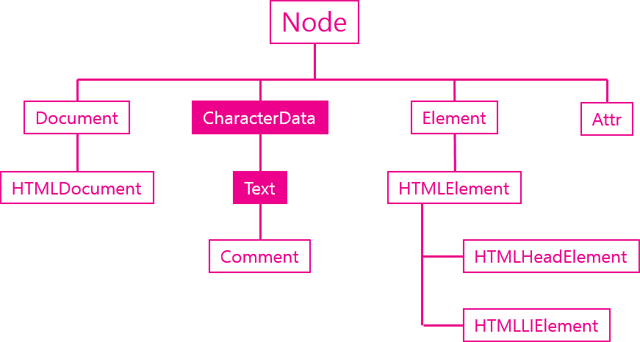

# TIL✏️ 2023.12.20 Wed

## Document 객체, Text 객체

## Document 객체

- DOM의 스팩
    - 웹브라우저에서는 HTMLDocument객체로 사용
        - HTMLDocument : 문서 전체 대표 객체


- 예제
    
    ```jsx
    <script>
    	//document 객체는 window 객체의 소속
    	console.log(window.document);
    	//document 객체의 자식으로는 Doctype과 html이 있음
    	console.log(window.document.childNodes[0]);
    	console.log(window.document.childNodes[1]);
    </script>
    ```
    

### 주요 API

> ### ***노드 생성 API***

노드 변경 API에서 학습했음

- createElement()
    - 태그 생성
    - ex) document.createElement(’li)
- createTextNode()

> ### ***문서 정보 API***

- title
    - 타이틀 가져오기
- URL
    - url 가져오기
- referrer
- lastModified

## Text 객체

- 노드를 상속받는 객체
- CharcterData 상속 받음
- DOM에서는 공백/줄바꿈도 텍스트 노드




- 예제
    
    ```html
    <p id="target1"><span>Hello world</span></p>
    <!-- p태그와 span 태그 사이의 공백 X -->
    <p id="target2">
        <span>Hello world</span>
    </p>
    <!-- 줄바꿈 및 공백 존재 -->
    <script>
    var t1 = document.getElementById('target1').firstChild;
    var t2 = document.getElementById('target2').firstChild;
     
    console.log(t1.firstChild.nodeValue);
    try{
        console.log(t2.firstChild.nodeValue);   
    } catch(e){
        console.log(e);
    }
    console.log(t2.nextSibling.firstChild.nodeValue);
     
    </script>
    ```
    

### 주요기능

> ### ***값***

- 텍스트 노드의 값을 가져오는 API
- DOM에서 실질적인 데이터 저장 객체
- nodeValue, data
    - 현재 노드 값이 포함된 문자열
    - 속성 노드의 속성값 변환 가능
- 예제
    
    ```html
    <ul>
        <li id="target">html</li> 
        <li>css</li>
        <li>JavaScript</li>
    </ul>
    <script>
        var t = document.getElementById('target').firstChild;
    		/* id가 target인 엘리먼트 찾음 -> <li id="target">html</li> 
    			 firstChild 프로퍼티로 접근 -> html이라는 text를 의미
    		 	 t = text */
        console.log(t.nodeValue);
    		// 결과 : html
        console.log(t.data);
    		// 결과 : html
    </script>
    ```
    

> ### ***조작***

- appendData()
    - 내용추가
    - `appendData(data)`
- deleteData()
    - 내용 지우기
    - `deleteData(start, end)`
- insertData()
    - 내용 추가
    - `insertData(start, 추가하고자하는 데이터의 vaule)`
- replaceData()
    - 내용 변경
    - `replaceData(start, end, data)`
- subStringData()
    - `subStringData(start, end)`

> ### ***생성***

- docuemnt.createTextNode()


## 문서의 기하학적 특성

### 위치, 크기

### ***요소의 크기와 위치***

- 요소의 크기와 문서의 시작점에서의 거리를 알 수 O
- 예제
    - 테두리 포함하여 알려줌
    
    ```html
    <style>
        body{
            padding:0;
            margin:0;
        }
        #target{
            width:100px;
            height:100px;
            border:50px solid #1065e6;
            padding:50px;
            margin:50px;
        }
    </style>
    <div id="target">
        Coding
    </div>
    <script>
    var t = document.getElementById('target');
    console.log(t.getBoundingClientRect());
    </script>
    ```
    
  

    
    화면에 표시되는 모습
    
  

    
    콘솔에서 실행한 결과
    
    getBoundingClientRect : 화면에 표시 되는 모습처럼 값을 알아내고 싶을 때 사용하는 API
    
    - 중첩시 예제
        
        ```html
        <style>
            body{
                padding:0;
                margin:0;
            }
            div{
                border:50px solid #1065e6;
                padding:50px;
                margin:50px;
            }
            #target{
                width:100px;
                height:100px;
            }
        </style>
        <div>
            <div id="target">
                Coding
            </div>
        </div>
        <script>
        var t = document.getElementById('target');
        console.log(t.getBoundingClientRect());
        console.log(t.offsetParent);
        </script>
        ```
        
    
    
    
    
    
    - offsetParent 속성 호출 : 측정의 기준이 되는 엘리먼트를 알고 싶을 때 사용
    - 항상 body가 기준이 되는 것은 아니라는 의미
    
    - ClientWidth, ClientHeight : 테두리 제외한 크기 알고 싶을 때 사용

### ***viewport***

- 문서가 브라우저의 크기보다 큰 경우 = 스크롤이 만들어짐 → 스크롤에 따라 위치의 값이 달라지기 때문
    
    ⇒ viewport가 필요
    

> ### ***viewport 좌표***

- `setInterval(함수, s)` : 뒤에 오는 함수를 n초에 한번씩 반복하는 것
- `window.pageYOffset` : 스크롤한 크기(스크롤한 길이/스크롤의 정도)를 알 수 O
- `getBoundingClientRect` : 스크롤에 따라 달라지는 좌표를 사용

> ### ***문서의 좌표***

- 뷰포트의 좌표에 스크롤된 정도를 더해서 알 수 O

```jsx
setInterval(function(){
    console.log('getBoundingClientRect : ', t.getBoundingClientRect().top, 'pageYOffset:', window.pageYOffset, 'document y:', t.getBoundingClientRect().top+window.pageYOffset);
}, 1000)
```

### 스크롤 제어

- 스크롤 값 변경
- 사용자의 스크롤을 확 변경할 수 O
- `scrollTo(x, y);` : 원하는 위치로 이동
- scrollLeft, scrollTop 프로퍼티 사용

### 스크린 크기 알아보는 방법

```jsx
console.log('window.innerWidth:', window.innerWidth, 'window.innerHeight:', window.innerHeight);
console.log('screen.width:', screen.width, 'screen.height:', screen.height);
```

- 스크린의 해상도, 모니터의 크기를 알려줌 → 사용자들이 주로 사용하는 통계 낼때 사용 ⇒ 어떤 크기에 맞춰 웹 페이지를 제작할 지 정할때 유용하게 사용함
