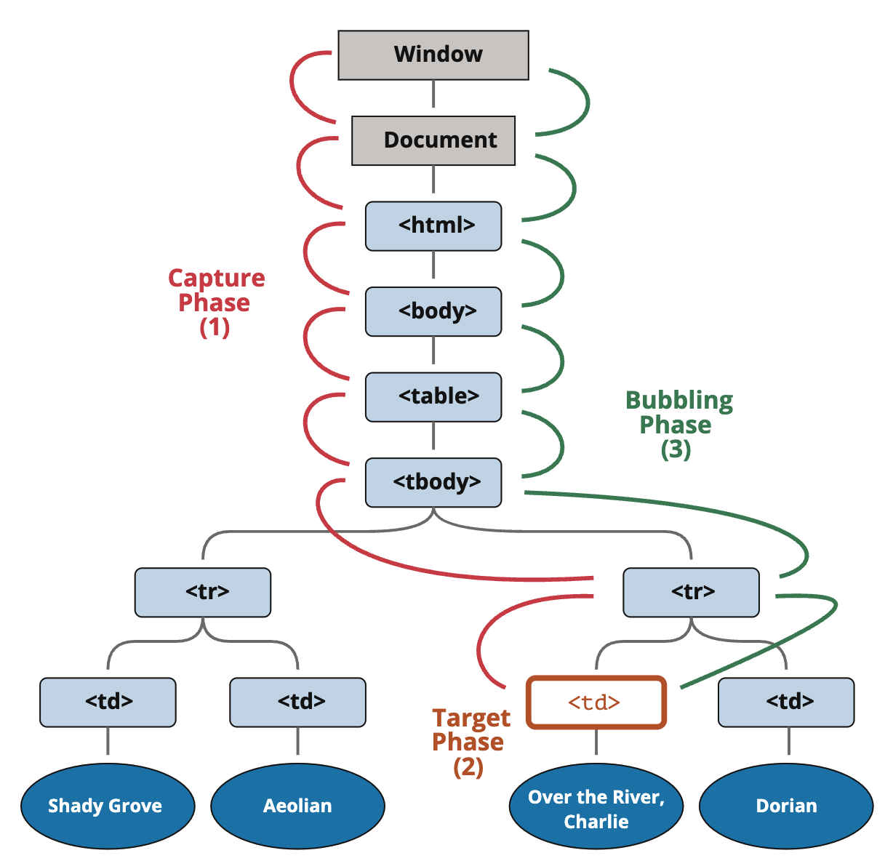

# TIL✏️ 2023.12.21 Thus

## 이벤트

- 어떤 사건을 의미 = 사용자가 ‘클릭했을 때’, ‘스크롤 했을 때’, ‘필드 내용을 바꿨을 때’
- `onclick` : ‘사용자가 버튼을 클릭했을 때’에 해당
- 어떤 일이 발생했을 때 실행되어야 하는 코드를 등록 → 브라우저는 그 일이 발생했을 때 등록된 코드 실행
    
    ⇒ 이벤트 프로그래밍
    
- 예시
    
    ```jsx
    <!DOCTYPE html>
    <html>
    <body>
        <input type="button" onclick="alert(window.location)" value="alert(window.href)" />
        <input type="button" onclick="window.open('bom.html')" value="window.open('bom.html')" />
    </body>
    </html>
    ```
    

> ### ***event target***

- 이벤트 대상(이벤트가 일어날 객체)를 의미
- 예제
    - 아래 코드에서 target =  버튼 태그에 대한 객체
    
    ```jsx
    <input type="button" onclick="alert(window.location)" value="alert(window.href)" />
    ```
    

> ### ***event type***

- 이벤트의 종류를 의미
    - click, scroll, mousemove했다는 것이 이벤트 타입
- 이벤트의 종류는 이미 약속되어 있음
- 이벤트의 종류 : https://developer.mozilla.org/en-US/docs/Web/Reference/Events

> ### ***event handler***

- 이벤트가 발생했을 때 동작하는 코드를 의미
    - 이벤트가 발생하면 어떤 행위를 보여줄 것이냐

### 등록방법

- 이벤트의 대상에 이벤트 핸들러를 등록해줘야 함
- 웹 브라우저에서 크게 3가지 종류의 등록방법 제공

### inline 방식

- inline : 태그 안에 이벤트가 속성으로 직접 들어가 있음
- 이벤트가 발생한 대상을 필요로 하는 경우 → this를 통해 참조
    - this 참조여부에 관한 예제
        
        ```html
        <!--자기 자신을 참조하는 불편한 방법-->
        <input type="button" id="target" onclick="alert('Hello world, '+docu<!ment.getElementById('target').value);" value="button" />
        <!-- 버튼을 클릭했을 때 경고창이 뜨면서 hello world 출력 + id값이 target인 값을 찾음 -> 해당 엘리먼트의 value값을 가져와서 Hello world 뒤에 붙여줌 -->
        
        <!--this를 통해서 간편하게 참조-->
        <input type="button" onclick="alert('Hello world, '+this.value);" value="button" />
        <!-- this를 작성하여 '해당 이벤트가 작동하고 있는 엘리먼트를 가리켜 줌 -->
        ```
        
    
    ⇒ this 사용 시 코드 관리 편리
    

> ### ***장단점***

**장점**

- 태그에 직접 기술되어 있기 때문에 바로 찾을 수 있음

**단점**

- 태그에 직접 기술되기 때문에 HTML과 JavaScript가 혼재된 형태 → 분류하여 관리할 수 없음 → HTML을 정보로서의 가치를 저하시킴

### PropertyListener 방식

- 이벤트 대상에 해당하는 객체의 프로퍼티로 이벤트를 등록하는 방식
- 변수로 이벤트를 줄 객체를 찾고 해당 변수에 이벤트의 프로퍼티에 함수를 지정해주는 방법

> ### ***이벤트 객체***

- event function
- 이벤트가 실행된 맥락의 정보가 필요할 때는 이벤트 객체를 사용
    - 이벤트 객체는 이벤트가 실행될 때 이벤트 핸들러의 인자로 전달

### addEventListener() 방식

- 해당 방식 사용을 가장 권장함
- 이벤트를 등록하는 가장 권장되는 방식
- 여러개의 이벤트 핸들러 등록 가능
- 예시
    
    ```html
    <input type="button" id="target" value="button" />
    <script>
        var t = document.getElementById('target');
        t.addEventListener('click', function(event){
            alert('Hello world, '+event.target.value);
        });
    </script>
    ```
    

> ### ***사용하는 이유***

- 이벤트 대상에 복수의 동일 이벤트 타입 리스너를 등록 가능
- 복수의 앨리먼트에 한의 리스너를 등록해서 재사용 할 수 O → 재활용 O
    - 예제
        
        ```html
        <input type="button" id="target1" value="button1" />
        <input type="button" id="target2" value="button2" />
        <script>
            var t1 = document.getElementById('target1');
        		// target1 식별자
            var t2 = document.getElementById('target2');
        		// target2 식별자
            function btn_listener(event){
        		// btn_listener 이벤트 리스너로 사용할 함수
                switch(event.target.id){
                    case 'target1':
                        alert(1);
                        break;
                    case 'target2':
                        alert(2);
                        break;
                }
            }
            t1.addEventListener('click', btn_listener);
        		// 클릭 btn_listener를 하여 함수를 var t1에 이벤트 리스너로 추가
            t2.addEventListener('click', btn_listener);
        		// 클릭 btn_listener를 하여 함수를 var t2에 이벤트 리스너로 추가
        </script>
        ```
        

> ### ***문제점***

- event.target.id : 각각의 엘리먼트들이 event target이 이벤트를 발생시켰을 때 해당 이벤트가 어디서 발생한 것인지 알아내는 방법

*switch문 : if문과 비슷 switch ~ case ~ break;

### 이벤트 전파

- HTML 태그는 중첩되어 있음 → 특정 태그에서 발생하는 이벤트는 중첩되어 있는 태그들 모두가 대상이 될 수O

> ### ***DOM 이벤트 흐름***

1. 캡처링 단계 : 이벤트가 하위요소로 전파되는 단계
2. 타깃 단계 : 이벤트가 실제 타깃 요소로 전달되는 단계
3. 버블링 단계 : 이벤트가 상위 요소로 전달되는 단계



> ### ***이벤트 버블링***

- 특정 화면 요소에서 이벤트 발생 시 해당 이벤트가 더 상위의 화면 요소들로 전달되어 가는 특성
- 한 요소에 이벤트가 발생하면 해당 요소에 할당된 핸들러 동작 → 부모요소 핸들러 동작
    
    (가장 최상단의 조사요소를 만날 때까지 해당 과정 반복)
    
- 하위 이벤트 시작 → 상위 이벤트 끝
    
  
    
- 중첩된 태그들에 이벤트가 등록되어 있는 경우 처리 방법(예제) -event bubbling
    
    ```html
    <html>
        <head>
            <style>
                html{border:5px solid red;padding:30px;}
                body{border:5px solid green;padding:30px;}
                fieldset{border:5px solid blue;padding:30px;}
                input{border:5px solid black;padding:30px;}
            </style>
        </head>
        <body>
            <fieldset>
                <legend>event propagation</legend>
                <input type="button" id="target" value="target">          
            </fieldset>
            <script>
            function handler(event){
                var phases = ['capturing', 'target', 'bubbling']
                console.log(event.target.nodeName, this.nodeName, phases[event.eventPhase-1]);
            }
    	      document.getElementById('target').addEventListener('click', handler, false);
    				// 인자3 : use capturing - 캡처링의 방식으로 작동하길 원하는 경우 true, 버블링 방식으로 작동하길 원하는 경우 false or 인자 사용 x
    				document.querySelector('fieldset').addEventListener('click', handler, false);
    				document.querySelector('body').addEventListener('click', handler, false);
    				document.querySelector('html').addEventListener('click', handler, false);
            </script>
        </body>
    </html>
    ---------------------------
    결과
    
    INPUT INPUT target
    INPUT FIELDSET bubbling
    INPUT BODY bubbling
    INPUT HTML bubbling
    ```
    

> ### ***이벤트 캡처링***

- 이벤트 버블링과 반대 방향으로 진행되는 이벤트 전파 방식

  

- 이벤트 캡쳐 구분 코드 : `addEventListener()` 옵션 객체에 `capture:true` 설정
    - 이벤트 감지하기 위해 이벤트 버블링과 반대 방향으로 탐색
- 중첩된 태그들에 이벤트가 등록되어 있는 경우 처리 방법(예제) - event capturing
    
    ```html
    <html>
        <head>
            <style>
                html{border:5px solid red;padding:30px;}
                body{border:5px solid green;padding:30px;}
                fieldset{border:5px solid blue;padding:30px;}
                input{border:5px solid black;padding:30px;}
            </style>
        </head>
        <body>
            <fieldset>
                <legend>event propagation</legend>
                <input type="button" id="target" value="target">          
            </fieldset>
            <script>
            function handler(event){
                var phases = ['capturing', 'target', 'bubbling']
                console.log(event.target.nodeName, this.nodeName, phases[event.eventPhase-1]);
            }
    				// 이벤트 버블링의 예제에서 flase였던 것을 true로 변경해줌
            document.getElementById('target').addEventListener('click', handler, true);
            document.querySelector('fieldset').addEventListener('click', handler, true);
            document.querySelector('body').addEventListener('click', handler, true);
            document.querySelector('html').addEventListener('click', handler, true);
            </script>
        </body>
    </html>
    ---------------------------
    결과
    
    INPUT HTML capturing
    INPUT BODY capturing
    INPUT FIELDSET capturing
    INPUT INPUT target
    ```
    
- 현재는 자주 사용하지 않음(이벤트 전파 흐름 아는데 유용)

> ### ***event.stopPropagation()***

- 이벤트 전파를 중간에 가로 막는 방법
- 이벤트 전달 방식을 알고 싶지 않고 원하는 화면 요소의 이벤트만 신경쓰고 싶을 때 사용
- 예제
    
    ```jsx
    function handler(event){
        var phases = ['capturing', 'target', 'bubbling']
        console.log(event.target.nodeName, this.nodeName, phases[event.eventPhase-1]);
    }
    // stopPropagation() 사용 예제
    function stophandler(event){
        var phases = ['capturing', 'target', 'bubbling']
        console.log(event.target.nodeName, this.nodeName, phases[event.eventPhase-1]);
        event.stopPropagation(); 
    }
    document.getElementById('target').addEventListener('click', handler, false);
    document.querySelector('fieldset').addEventListener('click', handler, false);
    document.querySelector('body').addEventListener('click', stophandler, false);
    document.querySelector('html').addEventListener('click', handler, false);
    ```
    

> ### ***이벤트 위임 - Event Delegation***

- 하위 요소에 각각 이벤트를 붙이지 않고 상위요소에서 하위요소의 이벤트들을 제어하는 방식
- ex) 이벤트에 엘리먼트를 추가하고자 할 때 그냥 추가하면 동작하지 x → 이벤트 리스너를 반복해서 달아줘야 함 → 해당 번거로움을 해결하기 위해 사용
- 예제
    
    할일 목록을 만드는 예제로 할일을 추가하고 싶을 때 사용하는 방법을 보여주고 있음
    
    ```html
    <h1>오늘의 할 일</h1>
    <ul class="itemList">
    	<li>
    		<input type="checkbox" id="item1">
    		<label for="item1">이벤트 버블링 학습</label>
    	</li>
    	<li>
    		<input type="checkbox" id="item2">
    		<label for="item2">이벤트 캡쳐 학습</label>
    	</li>
    </ul>
    <script>
    	var itemList = document.querySelector('.itemList');
    	// .itemList : ul 태그의 클래스 명
    	itemList.addEventListener('click', function(event) {
    		alert('clicked');
    	 });
    </script>
    ```
    

참고 : 

[이벤트 버블링, 이벤트 캡처 그리고 이벤트 위임까지](https://joshua1988.github.io/web-development/javascript/event-propagation-delegation/)

### 이벤트 기본 동작 취소

- 웹브라우저의 기본 동작 방법을 사용자가 만든 이벤트를 이용하여 취소하는 방법
- 웹브라우저의 구성 요소들이 갖고 있는 기본적인 동작 방법
    - 텍스트 필드에 포커스를 준 상태에서 키보드를 입력하면 텍스트가 입력 됨
    - 폼에서 submit 버튼 클릭 시 데이터 전송
    - a태그 클릭 시 href 속성의 URL로 이동

> ### ***inline 방식***

- 이벤트의 return값이 false이면 기본 동작 취소
    - 예제
        
        ```html
        <p>
            <label>prevent event on</label><input id="prevent" type="checkbox" name="eventprevent" value="on" />
        </p>
        <p>
            <a href="http://opentutorials.org" onclick="if(document.getElementById('prevent').checked) return false;">opentutorials</a>
        		<!-- 만약 document.getElementById('prevent')에 체크 되어 있으면 false를 return하여 기본 동작을 취소한다 -->
        </p>
        <p>
            <form action="http://opentutorials.org" onsubmit="if(document.getElementById('prevent').checked) return false;">
                    <input type="submit" />
            </form>
        </p>
        ```
        
    - 예를 들면 팝업창을 7일간 열지 않기 등의 이벤트 사용 가능

> ### ***property 방식***

- 이벤트의 return값이 false이면 기본 동작 취소
    - 예제
        
        ```html
        <p>
            <label>prevent event on</label><input id="prevent" type="checkbox" name="eventprevent" value="on" />
        </p>
        <p>
            <a href="http://opentutorials.org">opentutorials</a>
        </p>
        <p>
            <form action="http://opentutorials.org">
                    <input type="submit" />
            </form>
        </p>
        <script>
            document.querySelector('a').onclick = function(event){
                if(document.getElementById('prevent').checked)
                    return false;
            };
             
            document.querySelector('form').onclick = function(event){
                if(document.getElementById('prevent').checked)
                    return false;
            };
         
        </script>
        ```
        

> ### ***addEventListener 방식***

- 이벤트 객체의 preventDefault 메소드 실행 시 기본 동작 취소
    - 예제
        
        ```html
        <p>
                    <label>prevent event on</label><input id="prevent" type="checkbox" name="eventprevent" value="on" />
                </p>
                <p>
                    <a href="http://opentutorials.org">opentutorials</a>
                </p>
                <p>
                    <form action="http://opentutorials.org">
                            <input type="submit" />
                    </form>
                </p>
                <script>
                    document.querySelector('a').addEventListener('click', function(event){
                        if(document.getElementById('prevent').checked)
                            event.preventDefault();
                    });
                     
                    document.querySelector('form').addEventListener('submit', function(event){
                        if(document.getElementById('prevent').checked)
                            event.preventDefault();
                    });
         
                </script>
        ```
        
    - IE9 이하 버전은 event.returnValue를 false로 해야 함

## 이벤트 타입

- 이벤트의 종류

### form

- 사용자가 입력한 정보를 서버로 전송할 때 사용하는 여러가지 HTML 태그

> ### ***submit***

- 폼의 정보를 서버로 전송하는 명령어
    - form에 사용자가 입력한 정보를 서버로 전송할 때 사용하는 명령어
- 만약 값이 입력되지 않았다면 전송을 중단

```html
<form id="target" action="result.html">
    <label for="name">name</label> <input id="name" type="name" />
    <input type="submit" />
</form>
<script>
var t = document.getElementById('target');
t.addEventListener('submit', function(event){
    if(document.getElementById('name').value.length === 0){
		// 필드에 값의 길이가 0인지 확인하는 것
        alert('Name 필드의 값이 누락 되었습니다');
        event.preventDefault();
				// 정보를 전송하는 기본동작을 막은 것
    }
});
</script>
```

- `event.preventDefault();` : 전송 취소 명령어

> ### ***change***

- form 태그의 value(컨트롤)가 변경되었을 때 발생하는 이벤트

```html
<p id="result"></p>
<input id="target" type="name" />
<script>
var t = document.getElementById('target');
t.addEventListener('change', function(event){
    document.getElementById('result').innerHTML=event.target.value;
		// result의 <p id="result"></p>에 이벤트 객체의 <input id="target" type="name" />의 value값을 넣어라
});
</script>
```

- input(text,radio,checkbox), textarea, select 태그에 적용

> ### ***blur, focus***

- focus : 포커스가 생겼을 때(필드를 클릭 시 강조되는 것) 발생하는 이벤트
- blur : 포커스가 사라졌을 때 발생하는 이벤트
- 아래 태그를 제외한 모든 태그에서 발생
    - base 태그
    - bdo 태그
    - br 태그
    - head 태그
    - html 태그
    - iframe 태그
    - meta 태그
    - param 태그
    - script 태그
    - style 태그
    - title 태그

### 문서로드 이벤트

- 자바스크립트 실행 시 어떤 타이밍에 실행시킬 수 있는가와 관련된 문제
- 웹페이지를 프로그래밍적으로 제어하기 위해서는 웹페이지의 모든 요소에 대한 처리가 끝나야 함
    - load, DOMCintentLoaded 사용

> ### ***문서로딩***

1. 스크립트 문서를 끝에 위치 시키는 방법
2. `load`이벤트 이용
    - 예제
        
        ```html
        <head>
            <script>
                window.addEventListener('load', function(){
                    var t = document.getElementById('target');
                    console.log(t);
                })
            </script>
        </head>
        <body>
            <p id="target">Hello</p>
        </body>
        ```
        
    - 문서 내 모든 리소스(이미지, 스크립트)가 다운로드 끝난 후 실행→ 애플리케이션 구동 지연 부작용
        - 문서가 해외에 있거나 이미지가 크거나 등등의 문제가 있을 때 사용하면 좋지 X
3. `DOMContentLoaded` 사용
    - 문서에서 스크립트 작업을 할 수 있을 때 실행되기 때문에 이미지 다운로드를 기다릴 필요 없음
    - 예제
        
        ```html
        <html>
            <head>
                <script>
        	          /*  window.addEventListener('load', function(){
                        console.log('load');
                    }) */
                    window.addEventListener('DOMContentLoaded', function(){
                        console.log('DOMContentLoaded');
                    })
                </script>
            </head>
            <body>
                <p id="target">Hello</p>
            </body>
        </html>
        ```
        
    

### 마우스

> ### ***이벤트 타입***

- `click` : 클릭했을 때 발생하는 이벤트.
- `dblclick` : 더블클릭을 했을 때 발생하는 이벤트
- `mousedown` : 마우스를 누를 때 발생
- `mouseup` : 마우스버튼을 땔 때 발생
- `mousemove` : 마우스를 움직일 때
- `mouseover` : 마우스가 엘리먼트에 진입할 때 발생
- `mouseout` : 마우스가 엘리먼트에서 빠져나갈 때 발생
- `contextmenu` : 컨텍스트 메뉴가 실행될 때 발생

> ### ***키보드 조합***

- 마우스 이벤트가 호출될 때 특수키(alt, ctrl, shift)가 눌려진 상태인지 감지해야할 경우 이벤트 객체의 프로퍼티 사용
    - `event.shiftKey`
    - `event.altKey`
    - `event.ctrlKey`
    

> ### ***마우스 포인터 위치***

- 마우스 포인터의 위치를 알아내는 것이 중요한 경우 이벤트 객체의 clientX와 clientY 사용

---

- 마우스 이벤트 전체 예제
    
    ```html
    <html>
      <head>
        <style>
          body{
            background-color: black;
            color:white;
          }
          #target{
            width:200px;
            height:200px;
            background-color: green;
            margin:10px;
          }
          table{
            border-collapse: collapse;
            margin:10px;
            float: left;
            width:200px;
          }
          td, th{
            padding:10px;
            border:1px solid gray;
          }
        </style>
      </head>
      <body>
        <div id="target">
    
        </div>
        <table>
          <tr>
            <th>event type</th>
            <th>info</th>
          </tr>
          <tr>
            <td>click</td>
            <td id="elmclick"></td>
          </tr> 
          <tr>
            <td>dblclick</td>
            <td id="elmdblclick"></td>
          </tr>
          <tr>
            <td>mousedown</td>
            <td id="elmmousedown"></td>
          </tr>         
          <tr>
            <td>mouseup</td>
            <td id="elmmouseup"></td>
          </tr>         
          <tr>
            <td>mousemove</td>
            <td id="elmmousemove"></td>
          </tr>         
          <tr>
            <td>mouseover</td>
            <td id="elmmouseover"></td>
          </tr>         
          <tr>
            <td>mouseout</td>
            <td id="elmmouseout"></td>
          </tr>
          <tr>
            <td>contextmenu</td>
            <td id="elmcontextmenu"></td>
          </tr>         
        </table>
        <table>
          <tr>
            <th>key</th>
            <th>info</th>
          </tr>
          <tr>
            <td>event.altKey</td>
            <td id="elmaltkey"></td>
          </tr>
          <tr>
            <td>event.ctrlKey</td>
            <td id="elmctrlkey"></td>
          </tr>
          <tr>
            <td>event.shiftKey</td>
            <td id="elmshiftKey"></td>
          </tr>
        </table>
        <table>
          <tr>
            <th>position</th>
            <th>info</th>
          </tr>
          <tr>
            <td>event.clientX</td>
            <td id="elemclientx"></td>
          </tr>
          <tr>
            <td>event.clientY</td>
            <td id="elemclienty"></td>
          </tr>
        </table>
        <script>
        var t = document.getElementById('target');
        // 녹색상자 엘리먼트
        function handler(event){
          var info = document.getElementById('elm'+event.type);
          // elm = 엘리먼트 줄임말
          var time = new Date();
          var timestr = time.getMilliseconds();
          info.innerHTML = (timestr);
          if(event.altKey){
            // alt키를 사용자고 누르고 있다면 true 아니면 false
              document.getElementById('elmaltkey').innerHTML = timestr;
          }
          if(event.ctrlKey){
            // ctrl키를 사용자고 누르고 있다면 true 아니면 false
              document.getElementById('elmctrlkey').innerHTML = timestr;
          }
          if(event.shiftKey){
            // shift키를 사용자고 누르고 있다면 true 아니면 false
              document.getElementById('elmshiftKey').innerHTML = timestr;
          }
          // 마우스의 위치 X와 Y로 알 수 O
          document.getElementById('elemclientx').innerHTML = event.clientX;
          document.getElementById('elemclienty').innerHTML = event.clientY;
        }
        // 인자2에 모두 똑같은 이벤트 핸들러를 적용
        t.addEventListener('click', handler);
        // 마우스 클릭
        t.addEventListener('dblclick', handler);
        // 더블클릭
        t.addEventListener('mousedown', handler);
        // 마우스를 누를 때
        t.addEventListener('mouseup', handler);
        // 마우스를 눌렀다 뗄때
        t.addEventListener('mousemove', handler);
        // 마우스가 움직일 때
        t.addEventListener('mouseover', handler);
        // 마우스가 들어갔을 때
        t.addEventListener('mouseout', handler);
        // 마우스가 나갔을 때
        t.addEventListener('contextmenu', handler);
        // 오른쪽 클릭 했을 때
        // 기본동작 취소시키는 메소드 사용하면 작동 X
        </script>
      </body>
    </html>
    ```
    
    결과 : https://output.jsbin.com/pepib/4/
    

*이벤트는 강의 여러번 보는 것을 추천
