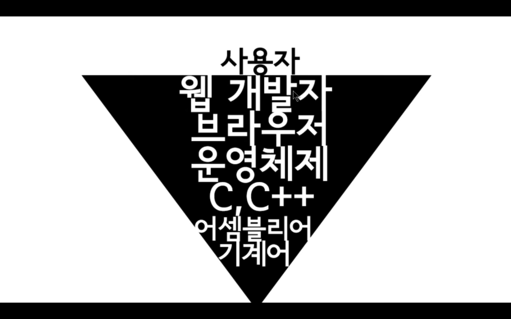
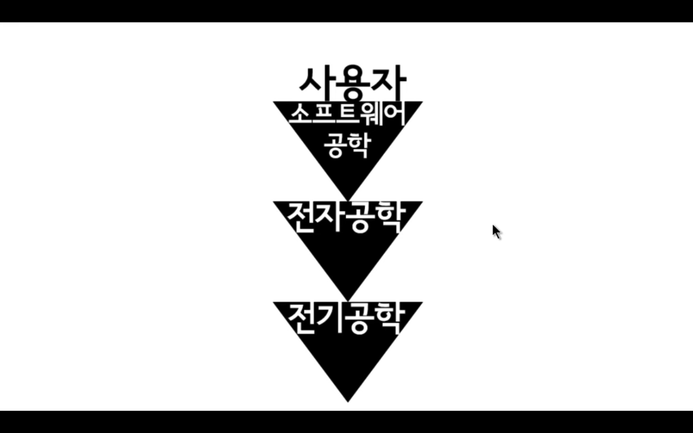

# TIL✏️ 2024.01.05 Fri

## UI, API문서

### UI

- User Interface
- 컴퓨터의 시스템과 사용자의 접점
- 사용자를 대면하는 접점이 되는 지점
- 웹사이트와 브라우저의 버튼들

### API

- Application Programming Interface
- 웹브라우저가 제공하는 조작방법 코드
- 웹브라우저 기반 시스템이 우리에게 제공한 인터페이스 (ex. arlet) → 응용하여 소프트웨어를 만듦
- 경고창 같은 것 = 웹브라우저 개발사에 소속되어 있는 개발자들이 만들음
    

    

    

### 문서보는 법

> ### ***레퍼런스와 튜토리얼***

- 튜토리얼 : 언어의 문법을 설명
- 레퍼런스 : 명령어의 사전

> ### ***자바스크립트 API***

- 자바스크립트 자체의 API와 자바스크립가 동작하는 호스트 환경의 API로 구분

**자바스크립트 API 문서**

- [ECMAScript (표준문서)](http://www.ecma-international.org/publications/standards/Ecma-262.htm)
- [자바스크립트 사전 (생활코딩)](http://opentutorials.org/course/50)
- [자바스크립트 레퍼런스 (MDN)](https://developer.mozilla.org/en-US/docs/Web/JavaScript/Reference)
- [jscript 레퍼런스 (MSDN)](http://msdn.microsoft.com/ko-kr/library/vstudio/z688wt03(v=vs.100).aspx)

**호스트 환경의 API 문서**

- [웹브라우저 API](https://developer.mozilla.org/en-US/docs/Web/API)
- [Node.js API](http://nodejs.org/api/)
- [Google Apps Script API](https://developers.google.com/apps-script/)
